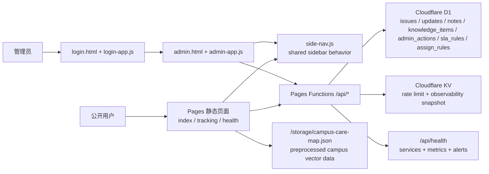

# 问题反馈系统

一个基于 Cloudflare Pages Functions、D1 与 KV 的校园问题反馈系统。当前仓库已经覆盖公开提交与追踪、后台运营台、SLA 监控与自动分配、动态知识库、心理咨询热区、健康检查、测试基建与安全加固。

## 当前状态

- `/api/health` 已扩展为结构化健康检查接口，覆盖 D1、KV、延迟、趋势、告警规则与脱敏错误日志。
- `/health.html` 已升级为健康检查面板，支持服务状态、关键指标、限流命中率与响应时间趋势展示。
- API 层新增统一安全头与 HTTPS 强制跳转保护，后台接口继续使用受控 CORS 与 Bearer 鉴权。
- 后台认证已升级为多用户账号 + JWT，保留共享密钥备用入口，并提供登录、登出、密码重置和用户管理 API。
- 首页与后台页已接入共享侧边菜单：桌面端左侧常驻导航，移动端左下角圆形入口打开抽屉式导航，并通过 `side-nav.js` 维护打开状态、键盘关闭和当前分区高亮。
- 公开首页已接入校园心理压力热区与懒加载校园矢量地图，地图使用预处理静态 GeoJSON 资产与 `/api/insights` 聚合数据渲染。
- 公开知识库已改为 D1 动态内容，后台可新增、编辑、禁用或删除知识条目，并与心理困扰类别关联。
- SLA 规则管理已上线：按优先级配置响应与解决截止时间，提交时自动写入截止时间，后台可查看即将超时与已超时问题。
- 自动分配规则已上线：按分类与关键词匹配处理人，公开提交时自动写入 `assigned_to`，支持中文分词关键词匹配（jieba-wasm，失败时降级为 n-gram）。
- 批量更新已上线：后台可一次性更新最多 100 条问题的状态、优先级与处理人，使用乐观并发校验避免覆盖冲突。
- 分配统计已上线：按处理人展示待处理、进行中、已解决数量与平均响应/解决时间，支持按周/月趋势。
- Vitest 已覆盖核心 API、共享工具、校园地图规则和前端数据处理辅助逻辑，并可生成覆盖率报告。
- GitHub Actions CI 已配置，提交或 PR 会自动构建样式、执行测试并上传覆盖率产物。

## 核心能力

- 公开用户提交问题并生成追踪编号
- 公开追踪页查看状态、时间线与公开回复
- 公开知识库按心理困扰类别动态展示自助建议
- 公开心理咨询热区展示，支持校园矢量地图悬停查看公开聚合数据
- 首页与后台运营台提供侧边分区导航，移动端使用菜单抽屉访问页面入口
- 后台运营台支持筛选、状态流转、备注、回复、知识库管理、导出与统计
- 后台支持 SLA 规则管理、自动分配规则管理、批量更新与分配统计
- 后台支持管理员账号登录、登出、用户创建/编辑/禁用与角色权限
- 健康检查 API 与可视化健康面板
- 限流、输入验证、日志脱敏、安全响应头与运维文档

## 架构图



## 主要页面与接口

### 页面

- `/`：公开提交页、公开问题列表与校园心理压力热区
- `/tracking.html`：追踪页
- `/login.html`：管理员账号登录、忘记密码、共享密钥备用入口
- `/admin.html`：后台运营台
- `/health.html`：健康检查面板

### 前端导航

- `/` 与 `/admin.html` 使用统一页面壳：`aside.side-nav` 作为侧边菜单，原有 `header`、`main`、`footer` 保留在内容区。
- 桌面端侧边菜单固定在左侧并随页面滚动保持可见；移动端通过左下角圆形菜单按钮打开左侧抽屉，避免遮挡页首标题。
- `side-nav.js` 负责移动端打开/关闭、遮罩关闭、`Escape` 关闭、链接点击后关闭，以及用视口中线计算当前分区；桌面端滚动到两个分区交界附近时，主菜单项保持深蓝高亮，相邻菜单项进入浅色过渡高亮。
- 后台页登录前隐藏后台分区导航，登录后再显示运营面板、知识库管理和问题列表入口；现有右侧问题详情抽屉保持独立层级。
- `/tracking.html` 与 `/health.html` 仍保持原布局，仅作为侧边菜单里的辅助入口。

### API

- `GET /api/health`
- `GET /api/issues`
- `POST /api/issues`
- `GET /api/issues/:trackingCode`
- `GET /api/insights`
- `GET /api/knowledge`
- `POST /api/admin/auth/login`
- `POST /api/admin/auth/logout`
- `POST /api/admin/auth/forgot-password`
- `POST /api/admin/auth/reset-password`
- `GET/POST /api/admin/users`
- `PATCH/DELETE /api/admin/users/:id`
- `GET /api/admin/issues`
- `GET/PATCH /api/admin/issues/:id`
- `POST /api/admin/issues/:id/notes`
- `POST /api/admin/issues/:id/replies`
- `POST /api/admin/issues/batch`
- `GET/POST /api/admin/sla/rules`
- `PATCH /api/admin/sla/rules/:id`
- `GET /api/admin/sla/violations`
- `GET/POST /api/admin/assign-rules`
- `PATCH/DELETE /api/admin/assign-rules/:id`
- `GET /api/admin/assign-stats`
- `GET/POST /api/admin/knowledge`
- `PATCH/DELETE /api/admin/knowledge/:id`
- `GET /api/admin/actions`
- `GET /api/admin/export`
- `GET /api/admin/metrics`

详细契约见 [docs/API.md](./docs/API.md)。

## 环境变量

| 变量 | 必填 | 用途 |
| --- | --- | --- |
| `ADMIN_SECRET_KEY` | 是 | 共享密钥备用 Bearer 鉴权 |
| `ADMIN_JWT_SECRET` | 是 | 后台 JWT HMAC-SHA256 签名密钥 |
| `ENVIRONMENT` | 是 | 环境标识：`local` / `preview` / `production` |
| `RESEND_API_KEY` | 通知功能需要 | 邮件通知投递密钥；未配置时邮件发送会失败并记录错误 |
| `ADMIN_RESET_EMAIL` | 密码重置建议配置 | 管理员密码重置邮件收件人；未配置时退回支持邮箱 |
| `PUBLIC_BASE_URL` | 否 | 邮件中的追踪链接基准地址；未配置时按请求来源或默认生产域名推断 |

本地示例见 `.dev.vars.example`。

## 开发命令

```bash
npm ci
npm run build:css
npm run dev
npm test
npm run test:coverage
npm run d1:migrate:local
```

## 测试与验证

- `npm test`：执行全部 Vitest 用例
- `npm run test:coverage`：输出 `output/coverage/` 覆盖率报告
- `test/sideNavPage.test.js`：覆盖首页与后台侧边菜单结构、移动端按钮、层级关系、桌面滚动过渡高亮和首页表单分组间距。
- `npm run build:map -- <geojson>`：从校园 GeoJSON 导出生成 `storage/campus-care-map.json`，仅地图源数据变化时需要重新运行

## 文档结构

- `docs/API.md`：当前 API 与公开静态资产契约。
- `docs/DEPLOYMENT.md`：Cloudflare 资源、迁移、部署与发布检查。
- `docs/SECURITY.md`：公开/后台数据边界与运行安全约束。
- `AGENTS.md`：仓库内编码代理使用的命令、约定和代码边界。

## 部署

部署说明、数据库迁移、Pages 绑定配置与 CI 说明见 [docs/DEPLOYMENT.md](./docs/DEPLOYMENT.md)。

## 安全说明

输入验证、CORS、HTTPS/HSTS、安全响应头、JWT/备用共享密钥、日志脱敏与“无 Cookie”策略见 [docs/SECURITY.md](./docs/SECURITY.md)。
