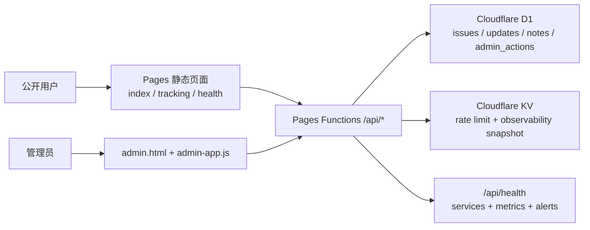

# 问题反馈系统

一个基于 Cloudflare Pages Functions、D1 与 KV 的校园问题反馈系统。当前仓库已经覆盖 `Phase 1`、`Phase 2` 与 `Phase 3`：公开提交与追踪、后台运营台、健康检查、测试基建与安全加固均已落地。

## Phase 3 结果

- `/api/health` 已扩展为结构化健康检查接口，覆盖 D1、KV、延迟、趋势、告警规则与脱敏错误日志。
- `/health.html` 已升级为健康检查面板，支持服务状态、关键指标、限流命中率与响应时间趋势展示。
- API 层新增统一安全头与 HTTPS 强制跳转保护，后台接口继续使用受控 CORS 与 Bearer 鉴权。
- Vitest 已补齐到 26 个测试文件 / 161 个测试用例，并可生成覆盖率报告。
- GitHub Actions CI 已配置，提交或 PR 会自动执行测试与覆盖率产物生成。

## 核心能力

- 公开用户提交问题并生成追踪编号
- 公开追踪页查看状态、时间线与公开回复
- 后台运营台支持筛选、状态流转、备注、回复、导出与统计
- 健康检查 API 与可视化健康面板
- 限流、输入验证、日志脱敏、安全响应头与运维文档

## 架构图



## 主要页面与接口

### 页面

- `/`：公开提交页与公开问题列表
- `/tracking.html`：追踪页
- `/admin.html`：后台运营台
- `/health.html`：健康检查面板

### API

- `GET /api/health`
- `GET /api/issues`
- `POST /api/issues`
- `GET /api/issues/:trackingCode`
- `GET /api/insights`
- `GET /api/admin/issues`
- `GET/PATCH /api/admin/issues/:id`
- `POST /api/admin/issues/:id/notes`
- `POST /api/admin/issues/:id/replies`
- `GET /api/admin/actions`
- `GET /api/admin/export`
- `GET /api/admin/metrics`

详细契约见 [docs/API.md](./docs/API.md)。

## 环境变量

| 变量 | 必填 | 用途 |
| --- | --- | --- |
| `ADMIN_SECRET_KEY` | 是 | 后台 Bearer 鉴权密钥 |
| `ENVIRONMENT` | 是 | 环境标识：`local` / `preview` / `production` |

本地示例见 `.dev.vars.example`。

## 开发命令

```bash
npm install
npm run dev
npm test
npm run test:coverage
npm run d1:migrate:local
```

## 测试与验证

- `npm test`：执行全部 Vitest 用例
- `npm run test:coverage`：输出 `output/coverage/` 覆盖率报告
- 当前覆盖率：`91.81%`
- 鉴权模块覆盖率：`97.18%`

## 部署

部署说明、数据库迁移、Pages 绑定配置与 CI 说明见 [docs/DEPLOYMENT.md](./docs/DEPLOYMENT.md)。

## 安全说明

输入验证、CORS、HTTPS/HSTS、安全响应头、日志脱敏与“无 Cookie”策略见 [docs/SECURITY.md](./docs/SECURITY.md)。
